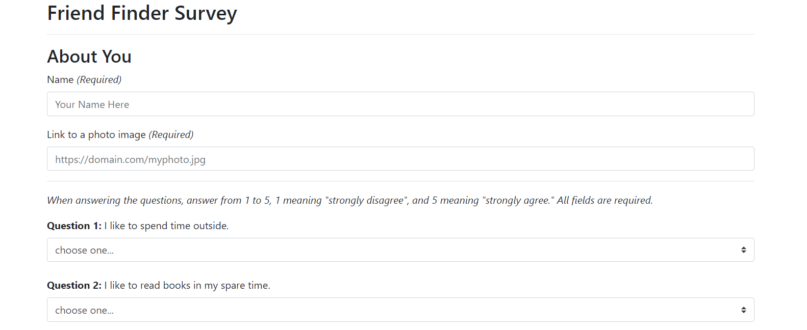

# Friend-Finder

###### Full-stack friend finding app using HTML5, Bootstrap, Node.js, and Express.js. Node modules body-parser, file system (fs) and path also used.

This browser based application is designed to find a friend with similar interests from a .json file which acts as a simple database. The user is first prompted to enter their name and a url to a picture of themselves and then answers 10 questions, selecting a value from 1 to 5 according to how much the user agrees with the statement. Submitting this information prompts the server to find a friend from the database with the most similar scores to the user, and the name and photo of this new friend appear as a modal on the web page.

Screenshot:

